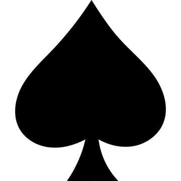

...
# Web Multiplayer Game With Next.js

# Etsicrew The Game
...

## A 2d game like brawlhalla or ssb alike using the following web technologies:

* Typecript(frontend)
* Next.js
* Phaser 3
* Socket.io
* Node.js

... and much more for general game development stuff like gimp or asprite and bandlab or fl studio.
Using new game development consepts and while also understanding how the web works.

## Installation

* Clone the repository 
* In the console run : npm install
* After its done run : npm run dev
* Navigate to localhost 3000 (or click on the terminal link) to see the game

